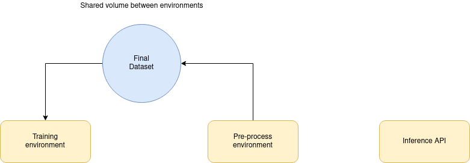

-----------------------------------------
# Deep learning networks for human activity recognition

## Pre-processing and training framework in tensorflow

This project provides a framework based on docker and aims to expedite the ***human activity classification*** training process. Thus, three separate environments are provided:
- Pre-processing environment.
- Training environment.
- Inference environment

While the ***training environment*** has a more general use, providing a generic tool to solve a vast amount of problems, the ***pre-processing environment*** has its focus on pre-processing human activity datasets (measured in a **quaternion** form) to solve the already mentioned ***"human activity classification problem"***.

Meanwhile, the ***inference environment*** serves a development framework to deploy a flask rest API. This API loads the desired neural network model and is able to answer prediction requests. This API is also focused on the human activity classification problem, but can be easily tuned for a more generic purpose. To know more about flask you can visit the [official flask webpage](https://flask.palletsprojects.com/en/1.1.x/). 

Pre-requirements:
 - Docker v17
 - GNU Make

The following instruction launches both environments:
```sh
# Launch the development environment
make develenv-up
```

Also a `make help` utility is available to the developer.

## Docker architecture 
For the reference there is a generic view of the architecture:



As you'd have noticed, the ***inference environment*** has little to do with the previous architecture and can be treated as an individual component. Ideally, this component will be the only one deployed in a production environment.

More information can be found here: [data structure documentation](framework)

## Pre-processing environmnent
```sh
# Enter the pre-processing environment
make preprocess-sh
```
The guide for this environment can be found here: [pre-process environment documentation](framework/pre-processing)

## Training environment
```sh
# Enter the training environment
make train-sh
```
The guide for this environment can be found here: [train environment documentation](framework/train)

## Inference environment
```sh
# Enter the pre-processing environment
make inference-sh
```
Although, the most useful command in this environment may be:
```sh
# Display container logs
docker logs -f framework_inferencer_1
```
The guide for this environment can be found here: [inference environment documentation](framework/inference)

# What is this project all about?
This project is the final assignment for Gonzalo Pardo Villalibre. The aim will be to detect which activity is a certain subject performing, minimizing the number of sensors needed. Therefore the student will take advantage of the use of NN (neural networks) from different types such as CNN (convolutional networks) or RNN (recurrent networks) such LSTM.

On this journey the developer decided to not only solve the concrete problem, but also to create a reusable framework making the process easier for future investigators.

More info about specific problem can be found here: [more info](doc/documents/this-problem.md)

# Contact

You can contact the creator via e-mail at: `gonzalopmb@gmail.com`

# Licensing

Copyright (C) Gonzalo Pardo Villalibre ( https://github.com/GonzaloPardoVillalibre )

This program is free software: you can redistribute it and/or modify it under the terms of the GNU Lesser General Public License as published by the Free Software Foundation, either version 3 of the License, or (at your option) any later version.

This program is distributed in the hope that it will be useful, but WITHOUT ANY WARRANTY; without even the implied warranty of MERCHANTABILITY or FITNESS FOR A PARTICULAR PURPOSE. See the GNU Lesser General Public License for more details.

You should have received a copy of the GNU Lesser General Public License along with this program. If not, see http://www.gnu.org/licenses/.