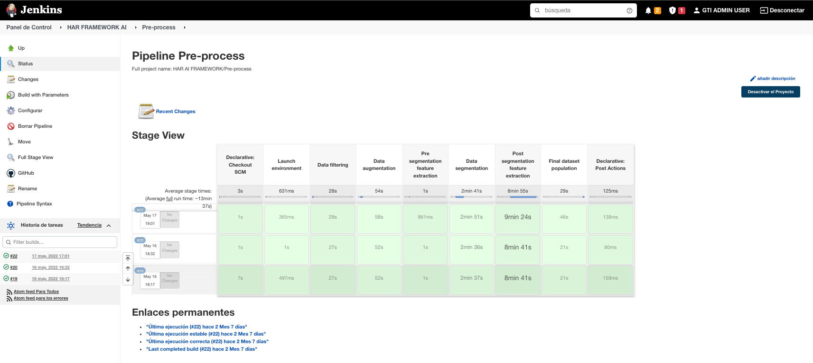
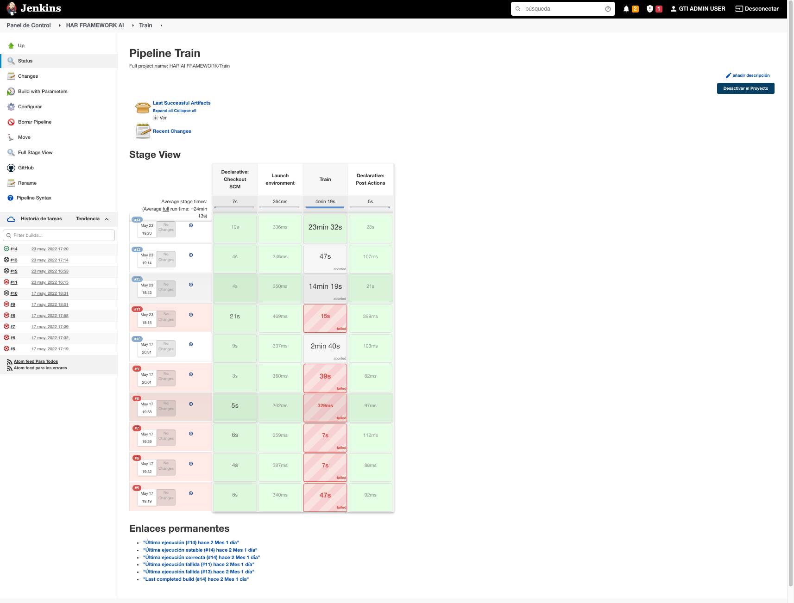

-----------------------------------------

# Delivery
The importance of continuous delivery is well known in the Tech world ([see more related info](https://www.zend.com/blog/continuous-delivery-benefits-and-barriers#:~:text=Continuous%20delivery%20makes%20your%20release,developers%20and%20IT%20operations%20staff)). Thus, this framework facilitates 
two pipelines for running both pre-processing and training phases. All you need to do is configure a
[jenkins instance](https://saucelabs.com/blog/a-getting-started-guide-to-setting-up-jenkins) and a 
[jenkins slave](https://dzone.com/articles/jenkins-03-configure-master-and-slave) which should be able to run
the framework as described in the main page. After some tinny tweaks on the configuration you should
be able to have everything set up as is:
1. Pre-process pipeline screenshot.
2. Train pipeline screenshot.

## Way of working
1. Each developer will work under his/her own branch. 
2. Before uploading to GitHub the desired pre-process and train configuration (refer to each environment documentation
if you have never heard of those) the developer should click on "Build with parameters".
3. Both pipelines will display a dashboard for choosing the configuration, similar as you will do while running
the framework in a local environment.The developer must select the right values so his pipeline will not interfere
with other developer's job.

## Pre-process pipeline

## Train pipeline
