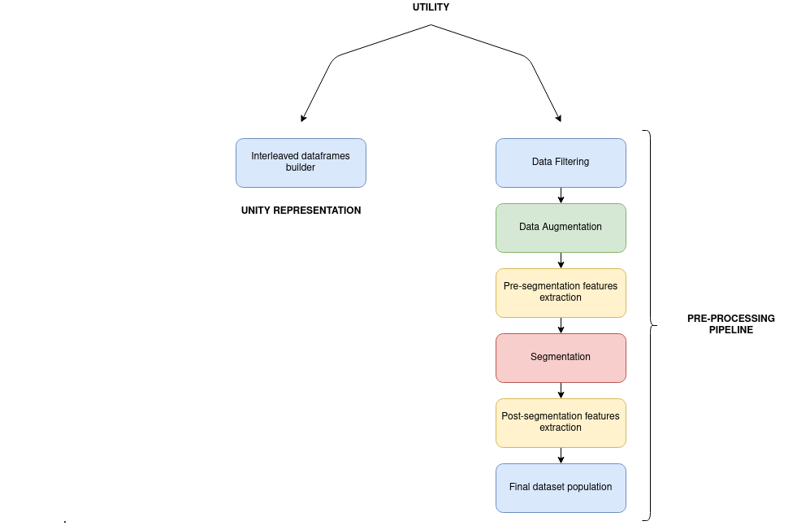
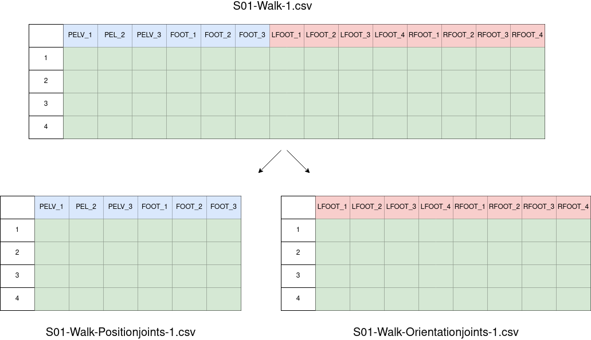
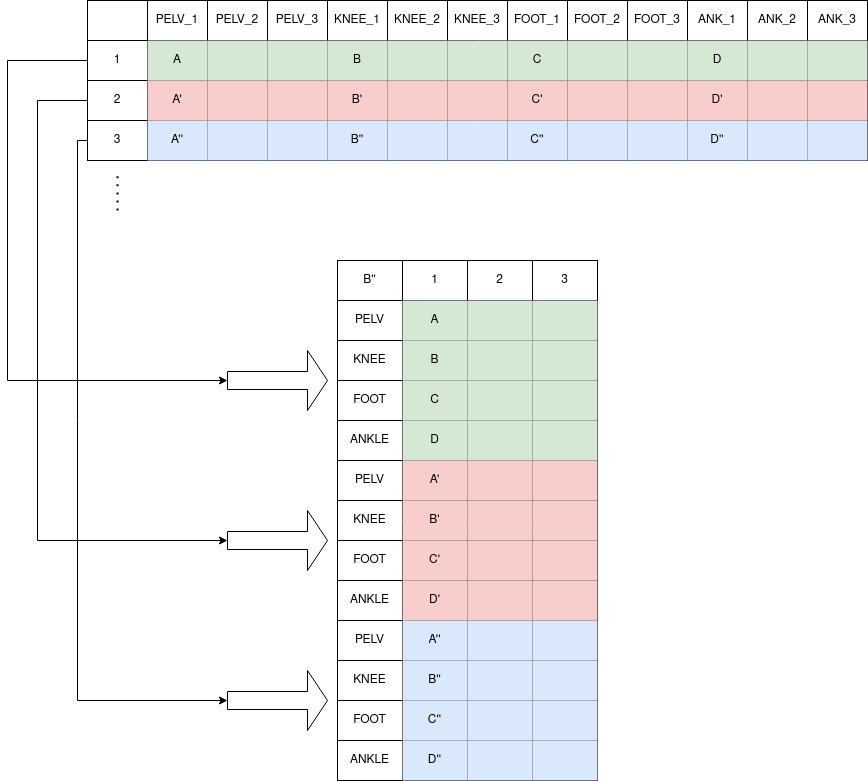

-----------------------------------------

# Pre-process environment
This environment represents the most specific utility of the framework and it is designed to preprocess time series datasets of ***quaternions*** or ***3D vectors***; such, for example, those obtained while measuring a certain subject performing any type of movement with inertial (IMUs) or optoelectronic (Vicon Vantage) sensors. To ensure your dataset fits the requirements, make sure to have a look at the **input dataset format** section.

This document includes the following sections:
- [Input dataset format](#Input-dataset-format)
- [Environment architecture](#Environment-architecture)
  - [Unity representation](#Unity-representation)
  - [Pre-processing pipeline](#Pre-processing-pipeline)
- [Usage guide](#Usage-guide)

If you also want to know more about quaternions: https://en.wikipedia.org/wiki/Quaternions_and_spatial_rotation

## Input dataset format: 
As said, if your original dataset does not contain such type of data, this environment may not fit your necessities. How must be my dataset, then if I want to use this environment? These are the requirements:

Dataframes (as .csv files) from N subjects performing different activities. Each dataframe must have the following format:
- **Rows must represent timesteps**, that means, one instant per row.
- **Colums must represent sensor's information**.
    - **Position sensors**

      Given a 3D sensor called "KNEE", position sensors columns must be named [KNEE_1, KNEE_2, KNEE_3]. A graphic example can be found here:  [position dataframe example](../../doc/images/pre-process/3d_vector_input_dataset.png)

    - **Orientatin sensors**

      Given a Quaternion sensor called "LFOOT", orientation sensors columns must be named [LFOOT_1, LFOOT_2, LFOOT_3, LFOOT_4]. A graphic example can be found here:  [orientation dataframe example](../../doc/images/pre-process/quaternion_input_dataset.png)
- **CSV files naming**, the name for each file must follow this rule **subject-activity-trial.csv**:
    
    - **subject**: name of the subject performing the activity. Each subject name must be unique and cannot be a substring of another subject name.
    - **activity**: label of the activity. Each label must be unique and cannot be a substring of other activity label.
    - **trial**: identifier to specify trial number in case there are multiple records for the same subject and activity. E.g. measures performed under different conditions/scenarios (ideal, usual, abnormal) or movements recorded twice. 

Some valid datasets examples could be:

- https://dataverse.harvard.edu/dataset.xhtml?persistentId=doi:10.7910/DVN/9QDD5J (Harvard dataset)
- https://archive.ics.uci.edu/ml/datasets/REALDISP+Activity+Recognition+Dataset (Archive-ics dataset)

**Important recall:** these are the format requirements in terms of data information. To make use of the environment you might have to tune the naming of your files or make other small changes in the dataframes. In fact, this was also the case for the databases mentioned above two tunning examples are included (one each).

- [Harvard-tunning-example](../tunning/Harvard-tunning-example)
- [Archive-ics-tunning-example](../tunning/Archive-ics-tunning-example)


## Environment architecture



As detailed earlier, this environment is intended to work with time-series dataframes composed either from **position** (3D) or **orientation** (quaternions) sensors. The architecture has two main functionalities:

- [Unity representation](#Unity-representation): dataset processing for Unity representation.
- [Pre-processing pipeline](#Pre-processing-pipeline): dataset pre-processing for input neural networks.


## Unity representation

With only one main module (interleaved-dataframe) it takes every csv from the input directory and builds dataframes ready to be represented in Unity. As 4D and 3D sensors will be treated independently by Unity, this module will split position(3D) original data from orientation(4D) original data to create the output files.

Given an input file called `S01-Walk-1.csv` containing both orientation and position sensors the graphical example for this transformation will be:



As represented two new files will be generated:

- `S01-Walk-Positionjoints-1.csv`: contains only position sensors data.
- `S01-Walk-Orientationjoints-1.csv`: contains only orientation sensors data.

Given one of those two files p.e. `S01-Walk-Positionjoints-1.csv` (only from position sensors in this case) this is a graphical example for the final output file (a equivalent transformation will be applied to the orientation file):



As probably not all the data from the original dataset is worth representing in Unity, it is possible to filter the desired subjects, activities, 4D sensors or 3D sensors. At this point you may want to check the  matching the following specification:

| Field | Type | Description |
| -------- |--------- | ----------- |
| subjects.list  | `Array<String>`| List of subjects to include in preprocess. |
| activities.list |`Array<String>` |  List of activities to include in preprocess. |
| activities.samples | `Array<String>` | List of trials to include in preprocess. |
| 4D-Sensors.enabled   | boolean | Enables orientation sensors processing. |
| 4D-Sensors.list | `Array<String>`  |  List of orientation sensors to include in preprocess. |
| 3D-Sensors.enabled   | boolean | Enables position sensors processing. |
| 3D-Sensors.list | `Array<String>` |  List of position sensors to include in preprocess. |

## Pre-processing pipeline

WORK IN PROGRESS

## Usage guide
Once you enter the preprocess environment, you can use `make` to perform the following operations:
```
Usage: make <command>
Commands:
    help:                                  Show this help information
  
    #########################
   #  UNITY-REPRESENTATION #
  #########################
    build-interleaved-dataframes           Build interleaved dataframes for Unity representation
  
    #########################
   # PRE-PROCESS PIPELINE  #
  #########################
    filter-data                            Execute data-filtering script
    augment-data                           Execute data augmentation script
    pre-segmentation-fe                    Execute pre-segmentation feature extraction
    post-segmentation-fe                   Execute post-segmentation feature extraction
    segment                                Execute segmentation script
    populate-fd                            Execute populate-final-dataset script
    run-pipeline                           Execute pre-process pipeline 

    Usual order:
      1. filter-data
      2. augment-data
      3. pre-segmentation-fe
      4. segment
      5. post-segmentation-fe
      6. populate-fd
```