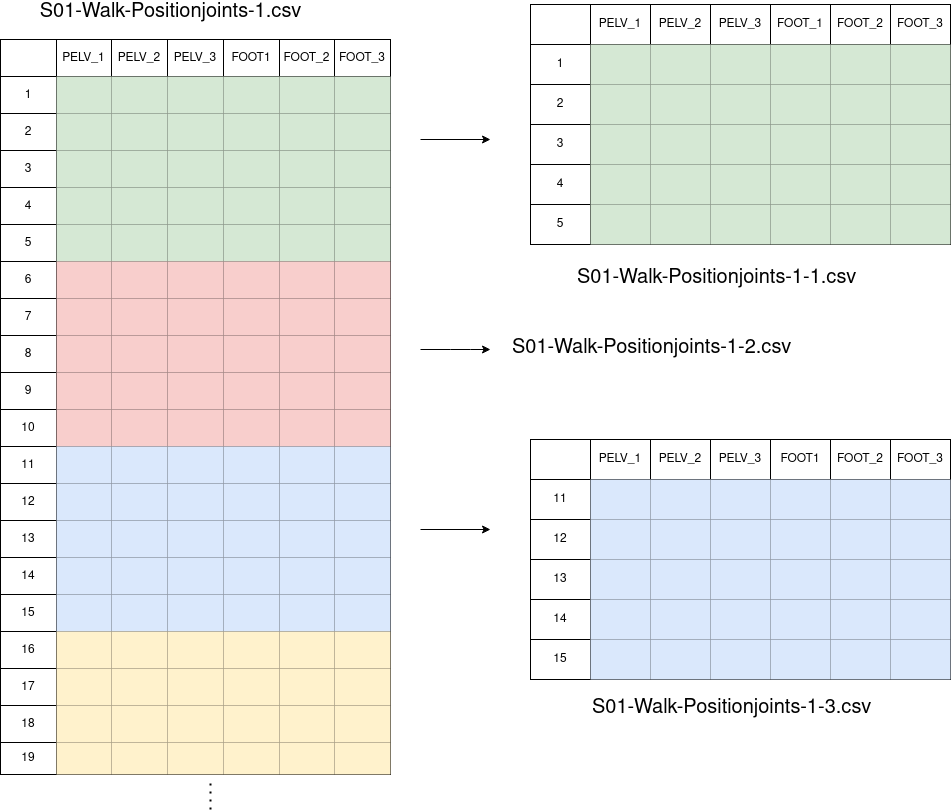

-----------------------------------------

# Pre-processing environment
This environment represents the most specific utility of the framework and it is designed to preprocess time series datasets of ***quaternions*** or ***3D vectors***; such, for example, those obtained while measuring any type of movement with sensors on a certain subject. To ensure your dataset fits the requirements, make sure to have a look at the **input dataset format** section.

This document includes the following sections:
- Input dataset format.
- Environment architecture & performance.
- Usage guide & configuration file.

If you also want to know more about quaternions: https://en.wikipedia.org/wiki/Quaternions_and_spatial_rotation

## Input dataset format: 
As said, if your original dataset does not contain such type of data, this environment may not fit your necessities. How must be my dataset then if I want to use this environment? These are the requirements:

Dataframes (as .csv files) from N subjects performing different activities. Each dataframe must have the following format:
- **Rows must represent timesteps**, that means, one instant per row.
- **Colums must represent sensor's information**.
    - **Position sensors**

      Given a 3D sensor called "KNEE", position sensors columns must be named [KNEE_1, KNEE_2, KNEE_3]. A graphic example can be found here:  [position dataframe example](doc/images/3d_vector_input_dataset.png)

    - **Orientatin sensors**

      Given a Quaternion sensor called "LFOOT", orientation sensors columns must be named [LFOOT_1, LFOOT_2, LFOOT_3, LFOOT_4]. A graphic example can be found here:  [orientation dataframe example](doc/images/quaternion_input_dataset.png)
- **CSV files naming**, the name for each file must follow this rule **subject-activity-trial.csv**:
    
    - **subject**: name of the subject performing the activity. Each subject name must be unique and cannot be a substring of other subject name.
    - **activity**: label for the activity. Each activity label must be unique and cannot be a substring of other activity label.
    - **trial**: identifier to specify trial number in case there are multiple records for the same subject and activity. This can be the case, e.g. for measures performed under different conditions/scenarios (ideal, usual, abnormal) or movements recorded twice. 

Some valid datasets examples could be:

- https://dataverse.harvard.edu/dataset.xhtml?persistentId=doi:10.7910/DVN/9QDD5J (Harvard dataset)
- https://archive.ics.uci.edu/ml/datasets/REALDISP+Activity+Recognition+Dataset (Archive-ics dataset)

**Important recall:** these are the minimum format requirements in terms of data information. Although, to make use of the environment you might have to tune the naming of your files or make other small changes. There are also included two tunnning examples for the already mentioned datasets.

- [Harvard-tunning-example](tunning-examples/Harvard-tunning-example)
- [Archive-ics-tunning-example](tunning-examples/Archive-ics-tunning-example)

## Environment architecture & performance

As detalied earlier, this environment is inteded to work with time-series dataframes build either from **position** (3D) or **orientation** (quaternions) sensors. The architecture is composed from 4 pseudo-independent modules and each one perfmors a specific pre-processing operation; those layers are:

- Interleaved dataframe
- Image builder & image enricher
- Final dataset

### Interleaved dataframe 

This module may be irrelevant for the general use as it provides an easy way to tunne the data for representing the movement in an Unity framework. This may be useful to check whether any sensor has corrupted data. 

Given one original dataframe build from position sensors this is a graphical example for the transformation:

### Image builder & image enricher

This both modules recover the original format and slide the dataframes in windows of **N time-steps** to fit the neural network, for the reference we will call them ***images***. That means, each .csv/dataframe will create a vast number of images. 

Given one original dataframe compound from position sensors, the subject with name ***S01*** and activity ***walk***; this is a graphical example for the image building process with size **5** time-steps:

Overlap between images can also be configured (given the same example with **2** steps of overlap):

This transformation is made in two steps: 
- 1- **Image builder**: taking the unity compatible format dataframes from the previous layer (interleaved dataframe) the utility builds multiple images with sizes:
    - **rows**: n-timeSteps\*numberOfSensors.
    - **columns**: 3 columns if position sensors are used 4 if orientation sensors are used.
 
    This allows the developer to test each image in unity. The output of this step is not represented but will be stored at `framework/pre-processing/image-builder/_output`

- 2- **Image enricher**: this utility resizes each image outputed from the *image builder* with sizes:
    - **rows**: n-timeSteps.
    - **columns**: 3\*numberOfSensors if position sensors are used 4\*numberOfSensors if orientation sensors are used.
 
    The output is the one represented upwards.

### Final dataset

TO DO

## Usage guide & configuration file

TO DO