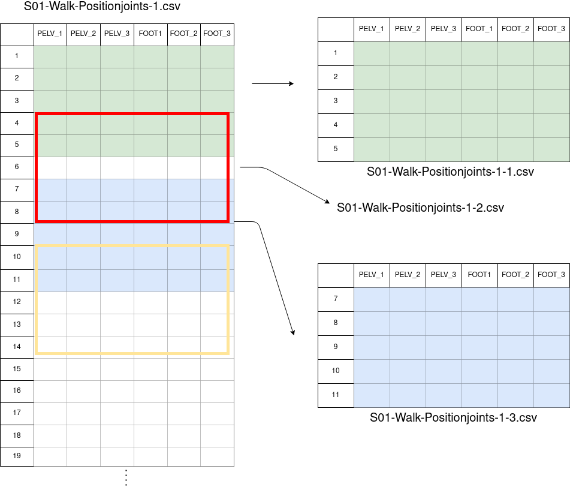

-----------------------------------------

# Pre-processing environment
This environment represents the most specific utility of the framework and it is designed to preprocess time series datasets of ***quaternions*** or ***3D vectors***; such, for example, those obtained while measuring any type of movement with sensors on a certain subject. To ensure your dataset fits the requirements, make sure to have a look at the **input dataset format** section.

This document includes the following sections:
- Input dataset format.
- Environment architecture & performance.
- Usage guide & configuration file.

If you also want to know more about quaternions: https://en.wikipedia.org/wiki/Quaternions_and_spatial_rotation

## Input dataset format: 
As said, if your original dataset does not contain such type of data, this environment may not fit your necessities. How must be my dataset, then if I want to use this environment? These are the requirements:

Dataframes (as .csv files) from N subjects performing different activities. Each dataframe must have the following format:
- **Rows must represent timesteps**, that means, one instant per row.
- **Colums must represent sensor's information**.
    - **Position sensors**

      Given a 3D sensor called "KNEE", position sensors columns must be named [KNEE_1, KNEE_2, KNEE_3]. A graphic example can be found here:  [position dataframe example](doc/images/3d_vector_input_dataset.png)

    - **Orientatin sensors**

      Given a Quaternion sensor called "LFOOT", orientation sensors columns must be named [LFOOT_1, LFOOT_2, LFOOT_3, LFOOT_4]. A graphic example can be found here:  [orientation dataframe example](doc/images/quaternion_input_dataset.png)
- **CSV files naming**, the name for each file must follow this rule **subject-activity-trial.csv**:
    
    - **subject**: name of the subject performing the activity. Each subject name must be unique and cannot be a substring of another subject name.
    - **activity**: label for the activity. Each activity label must be unique and cannot be a substring of other activity label.
    - **trial**: identifier to specify trial number in case there are multiple records for the same subject and activity. This can be the case, e.g. for measures performed under different conditions/scenarios (ideal, usual, abnormal) or movements recorded twice. 

Some valid datasets examples could be:

- https://dataverse.harvard.edu/dataset.xhtml?persistentId=doi:10.7910/DVN/9QDD5J (Harvard dataset)
- https://archive.ics.uci.edu/ml/datasets/REALDISP+Activity+Recognition+Dataset (Archive-ics dataset)

**Important recall:** these are the minimum format requirements in terms of data information. Although, to make use of the environment you might have to tune the naming of your files or make other small changes. There are also included two tunning examples for the already mentioned datasets.

- [Harvard-tunning-example](tunning-examples/Harvard-tunning-example)
- [Archive-ics-tunning-example](tunning-examples/Archive-ics-tunning-example)


## Environment architecture & performance


As detailed earlier, this environment is intended to work with time-series dataframes build, either from **position** (3D) or **orientation** (quaternions) sensors. The architecture is composed from 4 pseudo-independent modules, and each one performs a specific pre-processing operation; those layers are:

- Interleaved dataframe
- Image builder & image enricher
- Final dataset


### Interleaved dataframe 

Input dataframes/.csv can contain only 3D sensors information, only orientation sensors, or both. As orientation and position sensors will be treated independently for now on, this module will split position data and orientation data from the input files.

Given an input file called `S01-Walk-1.csv` containing both orientation and position sensors the graphical example of this transformation will be:


As represented two new files will be generated:

- `S01-Walk-Positionjoints-1.csv`: contains only position sensors data.
- `S01-Walk-Orientationjoints-1.csv`: contains only orientation sensors data.

The second operation of this module may be irrelevant to the general use as it provides an easy way to tune the data for representing the movement in a Unity framework. This may be useful to check whether any sensor has corrupted data. 

Given one dataframe/.csv called `S01-Walk-Positionjoints-1.csv` (only from position sensors) this is a graphical example for this second transformation:


### Image builder & image enricher

This both modules recover the previous non-unity format and slice the dataframes in windows of **N time-steps** to fit the neural network, for the reference we will call them ***images***. That means, each .csv/dataframe will create a vast number of images. 

Given one original dataframe compound from position sensors, the subject with name ***S01*** and activity ***walk***; this is a graphical example of the image building process with size **5** time-steps:


Overlap between images can also be configured (given the same example with **2** steps overlap):





This transformation is made in two steps: 
- 1- **Image builder**: taking the unity compatible format dataframes from the previous layer (interleaved dataframe) the utility builds multiple images with sizes:
    - **rows**: n-timeSteps * numberOfSensors.
    - **columns**: 3 columns if position sensors are used 4 if orientation sensors are used.
 
    This allows the developer to test each image in unity. The output of this step is not represented, but will be stored in `framework/pre-processing/image-builder/_output`

- 2- **Image enricher**: this utility resizes each image output from the *image builder* with sizes:
    - **rows**: n-timeSteps.
    - **columns**: 3 * numberOfSensors if position sensors are used 4 * numberOfSensors if orientation sensors are used.
 
    The output will be alike the one represented upwards.

But this is not everything yet, the ***image enricher*** module can perform another two optional operations:
- **Data augmentation**: this operation is exclusive for ***Orientationjoints*** images. 

    For a list of grades to rotate (see reference in ***Usage guide & configuration file*** section) this step will rotate each quaternion over the Z axis (assuming this is the vertical axis) and save the output in a newer image.
    
    This means, from a hypothetical image called `S01-Walk-Orientationjoints-1-1.csv` and a list of [0,90,180] three new images will be generated:

    - `S01-Walk-Orientationjoints-1-1-0.csv` (no rotation actually).
    - `S01-Walk-Orientationjoints-1-1-90.csv` (90º grade rotation round vertical axis).
    - `S01-Walk-Orientationjoints-1-1-180.csv` (180º grade rotation round vertical axis).


- **2D FFT calculation**:  this operation can be performed for both types of images.
    
    The 2D fast Fourier Transform is calculated for each image, then the value is split in two matrices, one for real and another one for imaginary values. It is optional to save the image without the 2D FFT, save only the 2D FTT new matrices or horizontally concatenate those matrices to the initial image.
    
    This is a graphical example for this very last option:

    


### Final dataset

This is the very last module of this environment, its unique function is to move the output from the ***image enricher*** to the shared volume ***"final-dataset"***. Activities can be filtered here.


## Usage guide & configuration file
Once you enter the preprocess environment, you can use `make` to perform the following operations:
```
Usage: make <command>
Commands:
  help:                                  Show this help information
  build-interleaved-dataframes           Excute interleaved dataframe script.
  build-images                           Excute image builder script.
  enrich-images                          Excute image enricher script.
  build-final-dataset                    Excute final dataset script.
  build-all:                             Execute all preprocessing steps by order.

Usual order:
  1. build-interleaved-dataframes
  2. build-images
  3. enrich-images
  4. build-final-dataset
```

But the real key of this environment is the vast amount of configurable parameters. This is done via the `framework/pre-processing/config.json` and should also be adapted for every different dataset. Also a preprocessing environment configuration file is included for the two already mentioned datasets:
- 
- 

**Reminder**: the name and path for the configuration file must always be 

The following tables will detail the confiragution parameters for each module: 

### Interleaved dataframe 
Fields inside `in-dt` block in `config.json`

| Field | Type | Description |
| -------- |--------- | ----------- |
| enabled  | boolean | Enables interleaved dataframe script execution. |
| subjects.list  | `Array<String>`| List of subjects to include in preprocess. |
| movements.list |`Array<String>` |  List of activities to include in preprocess. |
| movements.samples | `Array<String>` | List of trials to include in preprocess. |
| orientationSensors.enabled   | boolean | Enables orientation sensors processing. |
| orientationSensors.list | `Array<String>`  |  List of orientation sensors to include in preprocess. |
| position.enabled   | boolean | Enables position sensors processing. |
| position.list | `Array<String>` |  List of position sensors to include in preprocess. |

**Disclaimer**: fields such ***movements.list*** or ***sensors lists*** will have impact in other modules too.

### Image builder 
Fields inside `image-builder` block in `config.json`

| Field | Type | Description |
| -------- |--------- | ----------- |
| enabled  | boolean | Enables image builder script execution. |
| orientationSensors.enabled   | boolean | Enables orientation sensors processing. |
| positionSensors.enabled   | boolean | Enables position sensors processing. |
| images.window-size | int |  Time-steps per image. |
| images.overlap | int |  Time-steps shared with previous image. |
| deletePrevious | boolean | deletes output folder from the interleaved dataframe module. |

### Image enricher
Fields inside `image-enricher` block in `config.json`

| Field | Type | Description |
| -------- |--------- | ----------- |
| deepen-images   | boolean | Enables image enricher script execution. |
| table-images   | boolean | DRAFT: Enables table-images script execution. |
| dataAugmentationRotation.gradeList | `Array<Int>` | List of grades to perform data augmentation via rotation.**\*** |
| FFT.enabled | boolean | Enables 2D FFT calcuation. |
| FFT.combined | boolean | Enables combination of the initial image with the 2D FFT output. |
| FFT.saveWithoutFFT | boolean |  To save the initial image without the 2D FFT or not. |
| deletePrevious | boolean | deletes output folder from the interleaved dataframe module. |

**\***  "gradeList":[0] will mean no rotation is done.

### Final dataset
Fields inside `final-dataset` block in `config.json`

| Field | Type | Description |
| -------- |--------- | ----------- |
| movements.list | `Array<String>` |  List of activities to include in preprocess. |
| FFT-input | boolean | In case **FFT.combined** and **FFT-saveWithOutFFT** are both enabled this will select which image-enricher output propagate to the shared folder.|

