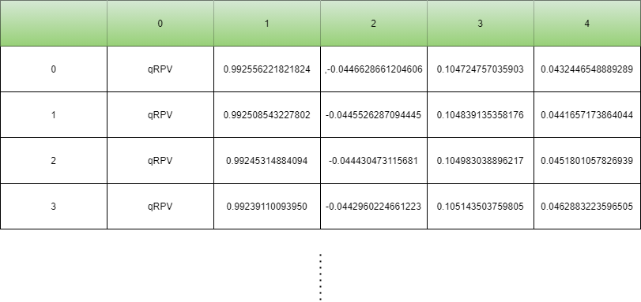
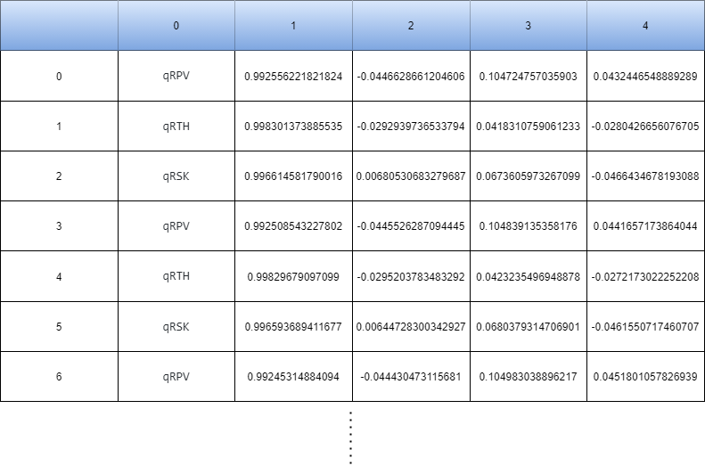
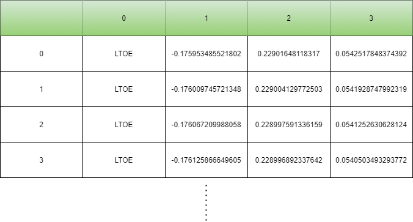
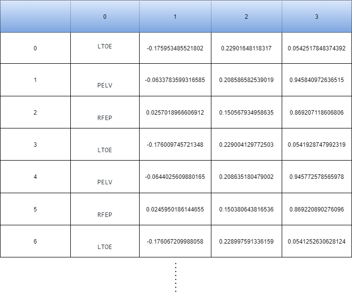

-----------------------------------------

# Pre-processing

## Composed interleaved dataframes
According to the information recorded by the sensors there will be `two` types of composed dataframes; one for `orientation` data (four inputs per row); and another one for `position` data (three inputs per row). Pre -processing of each type can be enabled via `config.json` and composed-dataframes csv will be named using the `subject` number (1-10), `movement` or activity, `sample` number (1-2) and dataframe type.

``` 
    Subject-Movement-Orientationjoints-Samplenumber.csv
    Subject-Movement-Positionjoints-Samplenumber.csv
```

### Orientation dataframes

+ #### Build individual dataframes per sensor
    Choosing at least one element from the available orientation sensor list:
    ```
     ["qRPV", "qRTH", "qRSK", "qRFT", "qLTH", "qLSK", "qLFT"]
    ```
    The script will build its individual dataframe. p.e. (qRPV):
    
    
    
+ #### Build composed & interleaved dataframe for a certain activity and subject:
    
    For every sensor chosen beforewards, the script will interleave its dataframes. p.e. (qRPV, qRTH & qRSK) : 

    
    

### Positon dataframes

+ #### Build individual dataframes per sensor
    Choosing at least one element from the available position sensor list:
    ```
     ["LTOE", "PELV", "RFEP", "LFEP", "RFEO", "LFEO", "RTIO", "LTIO"]
    ```
    The script will build its individual dataframe. p.e. (LTOE):
    
    

+ #### Build composed & interleaved dataframe for a certain activity and subject:

    For every sensor chosen beforewards, the script will interleave its dataframes. p.e. (LTOE, PELV & RFEP) : 

    
