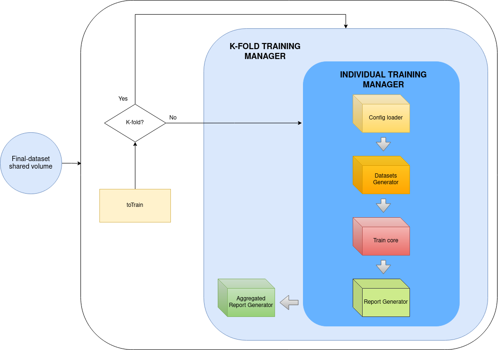
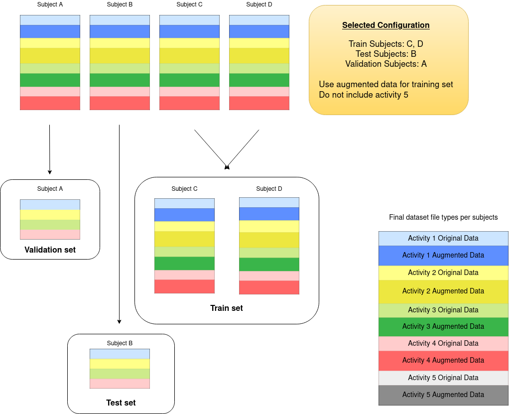
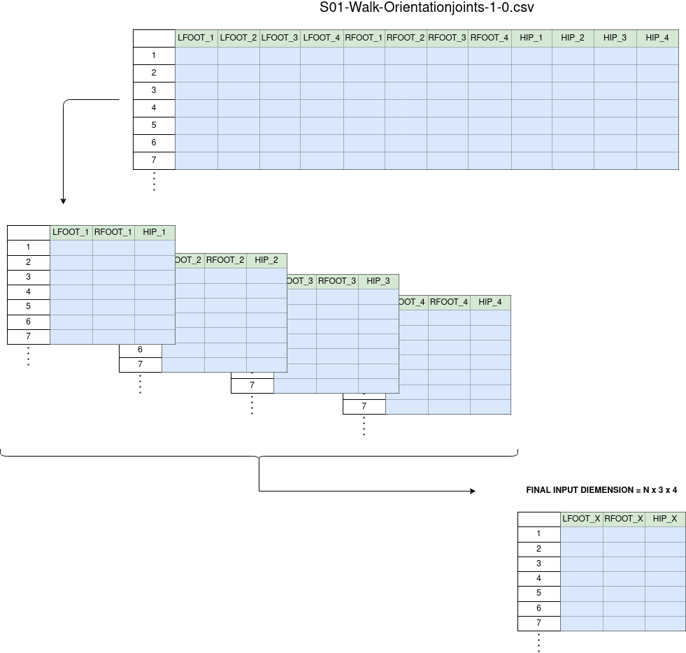

-----------------------------------------

# Training environment
This environment represents the most generic utility of the framework, and it is designed to train several
types of neural networks such CNN or RNN **given a dataset conformed by .csv files, where each .csv is 
a hole sample itself and the name of the .csv file describes the label of the sample**. Thus, 
the naming of the .csv files in the dataset is critical and will be reviewed in detail in the
***[Input dataset format](#Input-dataset-format)*** section.

This environment also provides a set of tools to automatically perform trainings varying parameters such:

- Files to conform the training, test and validation datasets.
- Tensorflow neural network model.
- Hyperparemeters.
- K-fold trainings for multiple subjects.

Finally, it also provides several tools to generate reports after the training process such **performance metrics** 
or **confusion matrices**.

For the reference, this document includes the following sections:
- [Input dataset format](#Input-dataset-format).
- [Environment architecture & performance](#Environment-architecture-&-performance).
- [Usage guide & training configuration files](#Usage-guide-&-training-configuration-files).

## Input dataset format: 
As mentioned, **.CSV files naming** is the key in this environment and must follow this rule:
`**subject(?)activity(?)-authenticity.csv**`:
    
- **subject**: name of the subject performing the activity. Each subject name must be unique and cannot be a substring of another subject name. Look at the first point of ***Can I still use this framework if...*** section if you don't have subjects.
- **activity**: label for the activity. Each activity label must be unique and cannot be a substring of another activity label. Look at the second point of ***Can I still use this framework if...*** section if you don't have activities.
- **authenticity**: identifier to specify whether the .csv proceeds from an original sample or is a result of any kind of augmentation. This is **very important**, as non original files will not be taken into account for validation and test datasets. Look at the third point of ***Can I still use this framework if...*** section if you don't have augmentation.

    - 0: If the .csv file comes from an original sample.
    - Not 0 if it comes from any type of augmentation.
        
**Important recall:** (?) marks mean any type of string can be in-between.

Some valid .csv names could be:
- **S01-A09-Orientationjoints-1-1-45.csv**
    - Subject: S01
    - Activity: A09 
    - Authenticity: not original or it comes from data augmentation.
    - Random strings in-between: -Orientationjoints-1-1
- **S01-A09-Orientationjoints-1-1-0.csv**
    - Subject: S01
    - Activity: A09 
    - Authenticity: original
    - Random string in-between: -Orientationjoints-1-1
- **S09-HighKneeJog-Orientationjoints-2-40-0.csv**
    - Subject: S09
    - Activity: HighKneeJog 
    - Authenticity: original
    - Random string in-between: -Orientationjoints-2-40

### Can I still use this framework if...
`... I don't have multiple subjects?`
Yes, but you  have to tune your data as dataset split into training, validation and test sets is made via the ***subject*** tag. E.g.:

- Train subjects: S01, S02, S03 (only files from this subjects are taken for training).
- Test subjects: S04 (only files from this subjects are taken for testing).
- Validation subjects: S05 (only files from this subjects are taken for validation).
    
Given your case, you want to create as much "fictional subjects" as possible to have the minor variance in results as you change one subject from one group to another.

`... I don't have activities, but something else?`
Yes, labeling is not reduced to *activities* but can be anything from potatoes to economical results for example.

`... I only have original data?`
Then all your files must end with ***-0.csv*** 

## Environment architecture & performance



This environment is not divided in modules such the pre-process environment. Although some logical blocks can be clearly distinguished.

### Individual Training Manager
#### Config loader
This first logical block loads training configurations from files stored in `framework/toTrain/`. For each file, the environment will perform a neural network training based on the specified rules using the dataset stored in the `final-dataset` shared volume.

If the configuration file is directly in this path it will be treated as an individual training; whereas if the file is in a subdirectory (with more other files) the hole subdirectory will be treated as a K-fold training scenario.

This type of training will be reviewed in detail in the ***K-Fold training manager*** section. If you want to know more about K-Fold cross validation visit https://machinelearningmastery.com/k-fold-cross-validation/. 

#### Datasets Generator

This logical block is in charge of splitting the input dataset into train, test and validation sets. The division will be made, as represented, via the ***"Subject"*** label and the subjects for each group can be modified via the training configuration file. It also provides the utility to filter the ***"Activities"*** included in the whole training process.

As mentioned, augmented data (marked with non -0.csv ending files) will not be used for validating and testing sets. Its use can also be discarded from the training set.

For example:



The entire training, test and validation sets are not loaded all at once in the RAM, but in batches of a fixed size specified in the `batch size` configuration variable. Two custom data loaders (custom data generators) have been created for this purpose following the rules specified in this [tensorflow custom datagenerator guide](https://www.tensorflow.org/guide/data).

Both of them take the exact amount of `.csv` files, and label each one given the activity specified in the `.csv` tittle. The first one will use the raw csv as an input matrix for the NN. Whereas the second data generator should only be used with `OrientationJoints.csvs` and will split the data in the csv into a fourth channel matrix; each channel will represent a 4D dimension and will only contain quaternion samples from one dimension. Here there is an example of the ***dataGenerator4D***:



For more information go to the ***Training configuration files (JSON)*** section.

#### Train Core
This logical block loads the specified neural network model and performs a training phase given the specified hyperparameters in the *training configuration file*. All the available neural network models must be stored in `framework/train/neuralNetworks` and will be dynamically loaded and selected by its name. Several examples for CNN, LSTM or CONVLSTM will be stored for the reference. 

- [CNN model example](neuralNetworks/N2.py)
- [LSTM model example](neuralNetworks/LSTM-1.py)
- [CONV-LSTM model example](neuralNetworks/CONVLSTM2D-1.py)
- [CNN-LSTM model example](neuralNetworks/CNN+LSTM-1.py)
- [CNN-GRU model example](neuralNetworks/CNN+GRU-Sergio.py)

The logical block will also perform two testing phases: 
- An evaluation phase.
- A prediction phase to build the report in the next block.

#### Report Generator
For each individual training a folder in `framework/train/trainOutcomes` is created. The name for each folder is the training starting time (to avoid any type of override). 

Each output folder contains the following report files:
- **outcome.txt** : Training summary; training and evaluation information.
- **confusion-matrix.png**:  A confusion matrix built up with the data from the prediction phase.
- **confusion-matrix-normalized.png**:  Normalized confusion matrix.
- **confusion-matrix-metrics.png**: Performance metrics table built from the confusion matrix.

Also some other files to reload the resultant trained neural network:
- **model.h5**
- **model.json**
- **config.json**: A copy from the training configuration file used for the case.
- **Some other files** with, for example, weight values if model checkpoints were used.

### K-Fold Training Manager
***[TO UPDATE]***
#### Aggreagated Report Generator
***[TO UPDATE]***

## Usage guide & training configuration files
Once you enter the train environment, you can use `make` to perform the following operations:
```
Usage: make <command>
Commands:
  help:                         Show this help information
  train:                        Start training process
```

But the real key for this environment is the vast amount of configurable parameters for each train we perform. 
This is done ,as explained, via the `framework/toTrain/` directory and the configuration file that must follow
. 

Also some training configuration files are included for the two already mentioned datasets:
-  
- 

### Training configuration files (JSON)
Each configuration file no matter if it belongs to a K-fold directory or and independent train must contain the following parameters.

| Field | Type | Description |
| -------- |--------- | ----------- |
| neural-network  | String | Selected neural network model from `framework/train/neuralNetworks` |
| no-augmentation | Boolean | If TRUE no data augmentation will be used in train phase |
| movements  | `Array<String>`| List of movements to include in preprocess |
| train-subjects  | `Array<String>`| List of subjects to include in training set |
| validation-subjects  | `Array<String>`| List of subjects to include in validation set |
| test-subjects  | `Array<String>`| List of subjects to include in test set |
| callbacks |`CallbackCustomObject` |  List of callbacks to include in train model \*. |
| input-rows | Int | .csv rows (characterizes the input sample size) |
| input-columns | Int | .csv columns (characterizes the input sample size)|
| channels | Int  |  Channels for CNN models \*\* |
| train-steps   | Int | Train steps |
| validation-steps | Int | Validation steps |
| test-steps | Int | Test steps |
| epochs | Int | Epochs |

\* Implementation of new CallBack types may not be easy.

\*\* This parameter should almost always value `1` as explained in the **Datasets Generator** section.

**Reminder**: All the files belonging to a K-fold should only vary `train-subjects`, `validation-subjects` and `test-subjects` from each-other.
